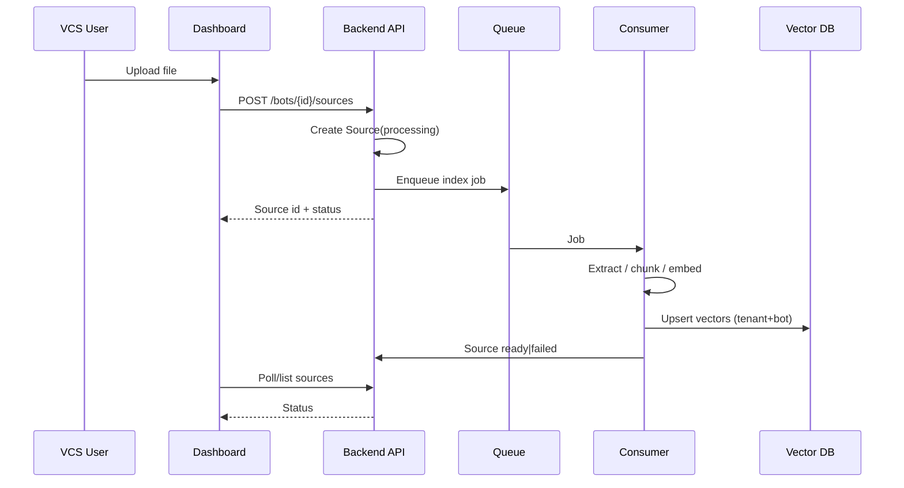
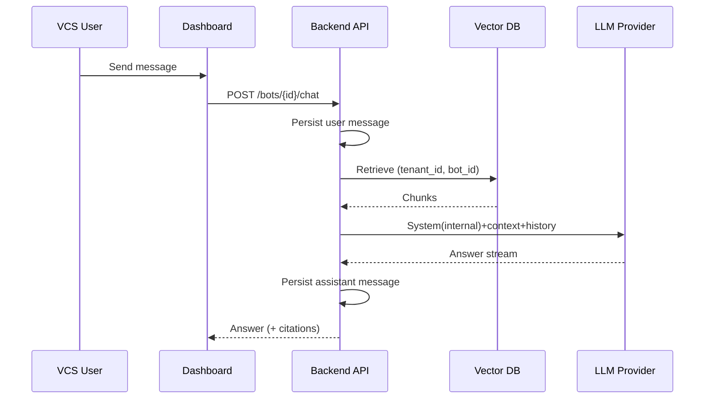

# Data flows

## Knowledge upload

```mermaid
sequenceDiagram
  participant U as VCS User
  participant D as Dashboard
  participant API as Backend API
  participant Q as Queue
  participant W as Consumer
  participant V as Vector DB

  U->>D: Upload file
  D->>API: POST /bots/{id}/sources
  API->>API: Create Source(processing)
  API->>Q: Enqueue index job
  API-->>D: Source id + status
  Q->>W: Job
  W->>W: Extract / chunk / embed
  W->>V: Upsert vectors (tenant+bot)
  W->>API: Source ready|failed
  D->>API: Poll/list sources
  API-->>D: Status
```

## Playground chat

```mermaid
sequenceDiagram
  participant U as VCS User
  participant D as Dashboard
  participant API as Backend API
  participant V as Vector DB
  participant LLM as LLM Provider

  U->>D: Send message
  D->>API: POST /bots/{id}/chat
  API->>API: Persist user message
  API->>V: Retrieve (tenant_id, bot_id)
  V-->>API: Chunks
  API->>LLM: System(internal)+context+history
  LLM-->>API: Answer stream
  API->>API: Persist assistant message
  API-->>D: Answer (+ citations)
```
